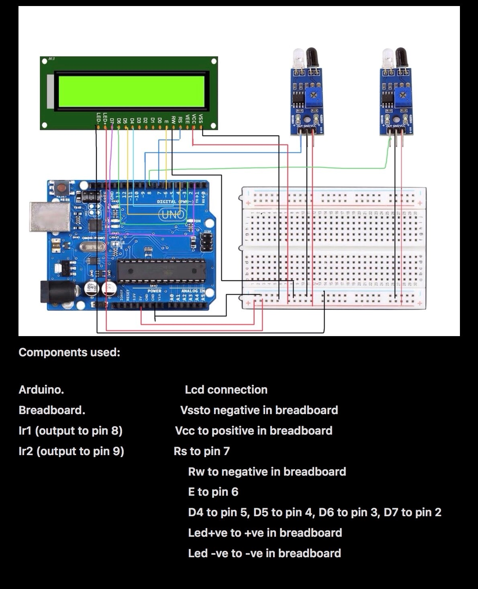

# 🏎️ Vehicle Speed Detection System (Arduino)

A high-precision velocity measurement system built using dual IR sensors and real-time LCD output. This system calculates the speed of an object passing between two points by measuring the "Time of Flight" at a microsecond resolution.

### 🚀 How it Works
1. **Detection:** Two IR sensors are placed at a fixed distance of **30 cm**.
2. **Timing:** An external trigger logic (using `micros()`) records the exact time the object breaks the first beam ($t_1$) and the second beam ($t_2$).
3. **Calculation:** The system calculates speed using:
   $$Speed\ (km/h) = \left( \frac{Distance}{t_2 - t_1} \right) \times 3.6$$

---

### 🔌 Hardware Configuration
Referencing the `speed.jpg` diagram:

| Component | Pin Function | Arduino Pin |
| :--- | :--- | :--- |
| **IR Sensor 1** | Start Trigger | Digital Pin 8 |
| **IR Sensor 2** | Stop Trigger | Digital Pin 9 |
| **LCD RS** | Register Select | Digital Pin 7 |
| **LCD Enable** | Enable | Digital Pin 6 |
| **LCD D4-D7** | Data Pins | Pins 5, 4, 3, 2 |

---

### 📸 Circuit Layout

---

### 🛠️ Technical Specifications
* **Microcontroller:** Arduino Uno R3
* **Sensor Type:** IR Obstacle Avoidance Modules.
* **Precision:** Microsecond ($\mu s$) timing.
* **Display:** 16x2 Character LCD.

---
**Developed by Manoj Kumar PV** *AI & Data Science Professional | Chaman Bhartiya School*
